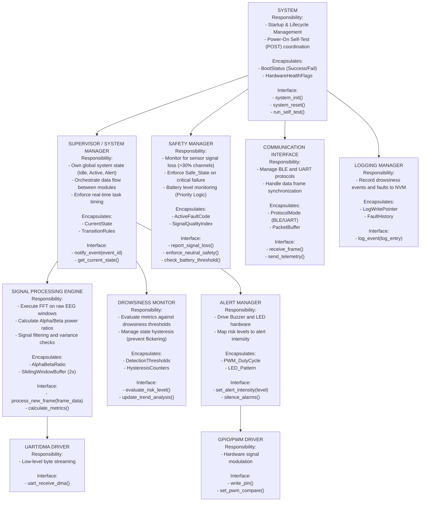

## Hierarchy of Control Diagram

---

## Dependency Constraints

**Allowed:**
- **Comms → Supervisor:** Notify when a valid frame window is ready.
- **Supervisor → Processing:** Command to update metrics.
- **Supervisor → Safety:** Report initialization success.
- **Monitor → Supervisor (via event):** Signal threshold crossing for state change.
- **AlertSystem → Drivers:** Hardware PWM/GPIO control.
- **All modules → Logger:** One-way logging of status and errors.

**Forbidden:**
- **Drivers calling upward:** Hardware interrupts must signal the Supervisor/Comms via flags or queues; they must not trigger high-level logic directly.
- **Logger influencing control:** Logging must be a non-blocking observer to prevent "logging-induced" latency.
- **Safety depending on UI:** Signal loss logic must function independently, even if the Touch Interface (UI) hangs.
- **Processing directly accessing AlertSystem:** All alerts must be mediated by the Supervisor/Monitor state to ensure centralized control.

**Global State Policy:**
- **Centralized Ownership:** Only the **Supervisor** owns the CurrentState variable (Idle, Active, Mild_Alert, High_Alert, Fault).
- **Data Encapsulation:** No shared mutable globals. Data passing (e.g., EEG frames) occurs via pointers to specific buffers managed by the Supervisor.
---

## Behavioral Mapping

| Module | Related States | Related Transitions | Related Sequence Diagrams |
| :--- | :--- | :--- | :--- |
| **Supervisor** | Idle, Active, Alert, Fault | All state changes | SD-1, SD-2, SD-3, SD-4 |
| **Safety** | Fault, Safe | SignalLoss (>30%), BatteryLow | SD-3 |
| **Processing** | Active | WindowUpdate (500ms) | SD-2 |
| **Monitor** | Mild_Alert, High_Alert | Metric > Threshold | SD-2, SD-3 |
| **Comms** | Idle, Active | FrameReceived | SD-2 |
| **AlertSystem** | Mild_Alert, High_Alert | Buzzer/LED Activation | SD-2, SD-3 |
---

## Interaction Summary

| Module | Calls | Called By | Shared Data? |
| :--- | :--- | :--- | :--- |
| **Supervisor** | Processing, Monitor | Comms, Safety | No |
| **Safety** | Supervisor, AlertSystem | System, Monitor | No |
| **Processing** | Comms (Data) | Supervisor | Yes (EEG Frames) |
| **Monitor** | AlertSystem, Safety | Supervisor | Yes (Metrics) |
| **Logger** | NVM Drivers | All | No |
| **Comms** | UART/BLE HAL | System | Yes (Raw Buffer) |
---

## Architectural Rationale

### Organizational Style: Coordinated Controllers
The architecture utilizes a **Coordinated Controller** model to satisfy stringent timing (FR-1) and safety (NFR-R1) requirements.

- **Centralized Control:** A dedicated **Supervisor** ensures that transitions from Idle to Active only occur when the Touch Interface validates user intent (UC-02).
- **Decoupled Safety:** The **Safety Manager** is separated from the normal data pipeline. This ensures that if the FFT processing (NFR-T1) hangs, the Safety Manager can still trigger a Safe_State or handle battery emergencies independently.
- **Stateless Alerting:** Following NFR-U1, the **Alert System** is driven by current risk levels determined by the Monitor, ensuring immediate response without internal dependency on previous states.

Safety logic is separated from normal control so that faults can override operation without depending on UI or logging.

---

## Task Split

| Member | Module(s) Owned | Responsibilities |
| :--- | :--- | :--- |
| **Manmay Maheshwari** | Supervisor | FSM Management, SD-1 Startup logic, SD-4 Recovery logic. |
| **Niket Sah** | Safety Manager | Signal integrity (FR-4), Battery Priority (FR-9), SD-3 safety logic. |
| **Parth Duta** | Processing Engine | FFT Computation (NFR-T1), Alpha/Beta math (FR-5). |
| **Shubham Mishra** | Drowsiness Monitor | Thresholding logic, Hysteresis, Trend Analysis (FR-6). |
| **Shubham Mishra** | Comms + AlertMgr | UART/BLE Drivers (FR-1/2), PWM/LED control, Logger implementation. |

---

## Individual Module Specification

## Step 8 – Individual Module Specifications

### 7.1 Supervisor (Manmay Maheshwari)

---

### 7.2 Safety Manager (Niket Sah)

---

### 7.3 Signal Processing Engine (Parth Duta)

#### Purpose and Responsibilities
Perform mathematical transformations on EEG data to calculate metrics required for drowsiness detection.

#### Inputs
- Raw EEG Data Frames (via UART/DMA)
- Processing Start/Stop commands

#### Outputs
- Alpha/Beta Power Ratios
- Signal Variance metrics

#### Internal State
- **SlidingWindowBuffer**: 2-second history.
- **FFT_Configuration**

#### Initialization / Deinitialization
- **Init**: Configure FPU (Floating Point Unit) and initialize CMSIS-DSP FFT tables.
- **Reset**: Flush all EEG buffers and reset sliding window pointers.

#### Basic Protection Rules
- **WCET Guarantee**: Logic must complete within 50ms to prevent buffer overflow (NFR-T1).
- Reject input frames if checksum or data integrity fails.

#### Module-Level Tests

| Test ID | Purpose | Stimulus | Expected Outcome |
|:---|:---|:---|:---|
| **T-C1** | Windowing Timing | 500ms Timer Tick | Metrics updated every 500ms |
| **T-C2** | Math Robustness | Zero-value EEG frame | Calculation returns safe error code |

---

### 7.4 Drowsiness Monitor (Shubham Mishra)

---

## Architectural Risk

### Identified Risk: Computational Jitter & Latency
The 512-point FFT required for EEG processing (FR-5) is computationally expensive. If the **Signal Processing** module consumes too many CPU cycles, it may cause "jitter" in the **Comms** interrupts, leading to dropped UART bytes or delayed **Alert** responses beyond the safety-critical 500ms limit (FR-7).

---

### Mitigation
- **Prioritized Preemption**: The Alarm Task and Safety Manager are assigned higher execution priority than the Processing task (NFR-T3) to ensure safety alerts are never blocked.
- **DMA Offloading**: Utilize **Direct Memory Access (DMA)** for UART frames to decouple data movement from CPU execution, ensuring the CPU only touches data when a full window is ready.