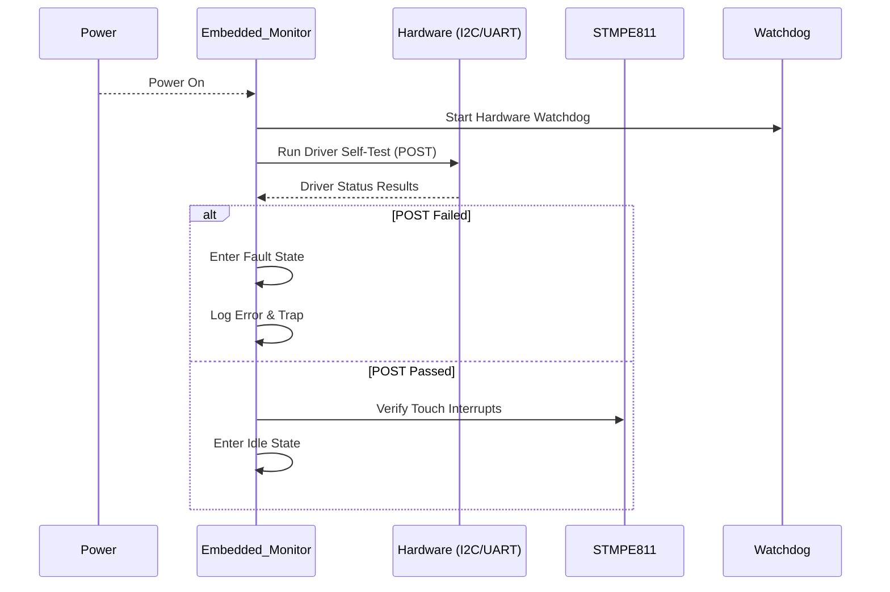
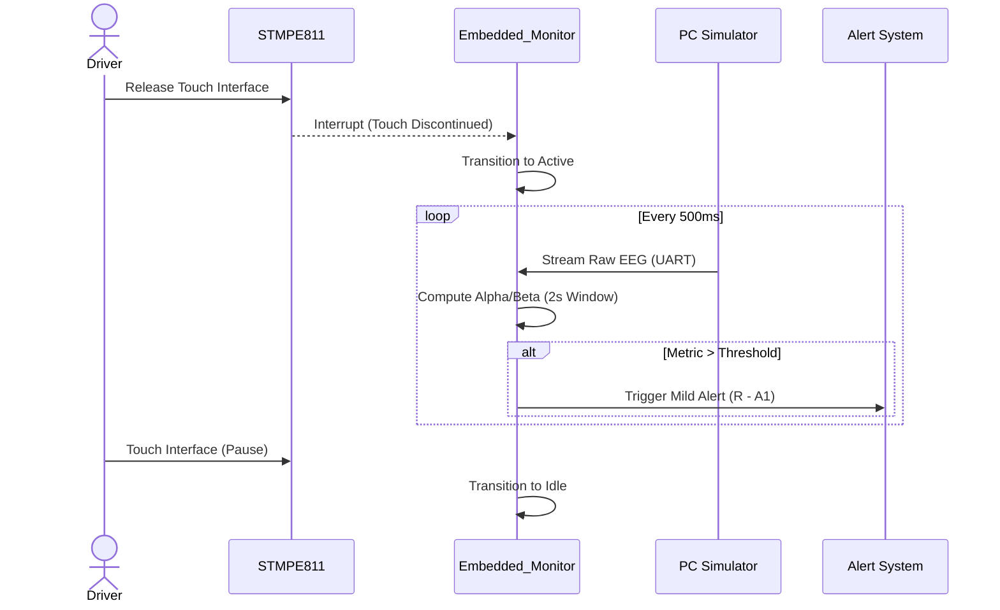
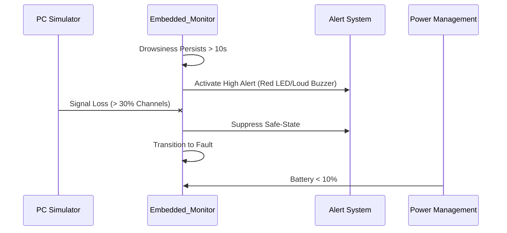
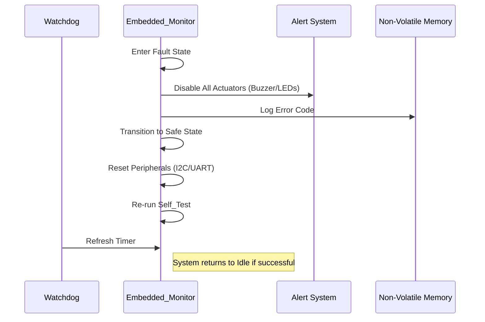

## 1. Key Sequence Diagrams

### SD-1: System Start-up

---

### SD-2: Detect Drowsiness (Calculate Alpha/Beta)

---

### SD-3: Safety-Critical – Drowsiness persists

---

### SD-4: Recovery After Fault

---

## 2. Updated Traceability Matrix

| Requirement | Statechart Element(s) | Sequence Diagram(s) | Test ID |
|:---|:---|:---|:---|
| **R - F1** Compute Metrics | Active | SD-2 | T-1 |
| **R - A1** Alert Latency | Mild_Alert | SD-2 | T-3 |
| **R - P1** Battery Priority | Active, High_Alert | SD-3 | T-5 |
| **R - FD1** Power-On Self-Test | Self_Test | SD-1 | T-2 |
| **R - FD2** Fault on Signal Loss | Fault | SD-3 | T-4 |
| **R - FD3** Fault Recovery | Safe, Self_Test | SD-4 | T-6 |

---

## 3. Test Plan

The tests are **design-level** and do not include implementation details.

### T-1: Startup Self-Test and Safe Initialization

**Related Requirements**
- **R - FD1:** Power-On Self-Test (POST)
- **UC-01:** System Startup logic

**Purpose** Verify that the system initializes safely, performs hardware self-tests, and does not enter an active monitoring state unintentionally.

**Preconditions**
- Device powered off.
- STMPE811 and UART sensors connected.
- Buzzer and LEDs initially de-energized.

**Stimulus**
- Apply power to the system.

**Test Steps**
1. Power on the device.
2. Observe the initialization sequence via Serial Debug.
3. Observe the success/failure of the driver self-test (I2C/UART).
4. Verify the system state via the status LEDs.

**Observations / Measurements**
- System state transitions (Initializing -> Self_Test -> Idle).
- I2C/UART peripheral status flags.
- PWM signal status for Buzzer (must be 0% duty cycle).
- Watchdog timer start confirmation.

**Expected Outcome**
- System performs POST.
- Actuators remain inactive.
- System enters Idle state if tests pass.
- System enters Fault state if any driver fails.

**Pass/Fail Criteria**
- **PASS** if no alarm activity occurs before entering Idle.
- **FAIL** if system transitions to Active without user release of touch sensor.

---

### T-2: Normal Monitoring and Sliding Window Update

**Related Requirements**
- **R - F1:** Sliding window computation
- **FR-1:** UART frame reception timing

**Purpose** Verify that the system correctly updates the EEG-derived metrics every 500ms using the 2-second buffer.

**Preconditions**
- System in Idle state.
- PC Simulator ready to stream EEG data.

**Stimulus**
- Release touch screen (STMPE811).

**Test Steps**
1. Release touch interaction.
2. Start EEG data stream from PC Simulator.
3. Measure the frequency of the computation task using a logic analyzer on the designated debug GPIO.

**Observations / Measurements**
- Transition from Idle -> Active.
- GPIO toggle interval (Target: 500ms).
- Buffer occupancy (Target: 20 frames).

**Expected Outcome**
- System begins sampling and computing metrics only after touch is discontinued.
- Computation occurs deterministically every 500ms.

**Pass/Fail Criteria**
- **PASS** if computation cycle is 500ms (±10%).
- **FAIL** if buffer overflows or calculation lags behind real-time data.

---

### T-3: Drowsiness Detection and Alert Latency

**Related Requirements**
- **R - A1:** Alert activation within 500ms
- **UC-03:** Detect Mild Drowsiness

**Purpose** Verify that the system identifies an unsafe state and notifies the driver within the safety-critical time bound.

**Preconditions**
- System in Active monitoring mode.
- Baseline calibration complete.

**Stimulus**
- Inject a data frame with Alpha/Beta ratio > Threshold 1.

**Test Steps**
1. Inject the "Drowsy" EEG frame.
2. Measure time delta between UART reception and Buzzer/LED activation using an oscilloscope.

**Observations / Measurements**
- Time from trigger to output.
- PWM frequency of the Buzzer.
- System transition: Active -> Mild_Alert.

**Expected Outcome**
- Alert triggers immediately upon threshold crossing.

**Pass/Fail Criteria**
- **PASS** if total latency $\le 500$ ms.
- **FAIL** if alert is delayed or system remains in Active state.

---

### T-4: Critical Escalation and Vehicle ECU Signal

**Related Requirements**
- **UC-05:** Escalation to High Alert
- **R - A1:** High-level alert management

**Purpose** Verify that the system escalates to a high-intensity alarm and triggers the vehicle interface if drowsiness persists.

**Preconditions**
- System in Mild_Alert state.

**Stimulus**
- Maintain EEG metrics above Threshold 2 for > 10 seconds.

**Test Steps**
1. Initiate a "Mild Drowsiness" state.
2. Increase simulated drowsiness to "Critical" levels.
3. Observe state transition and external ECU signal.

**Observations / Measurements**
- Change in Buzzer tone/LED color (Yellow to Red).
- GPIO state for Vehicle ECU interface.
- State transition: Mild_Alert -> High_Alert.

**Expected Outcome**
- High Alert activates after the 10-second persistent window.
- ECU signal is asserted.

**Pass/Fail Criteria**
- **PASS** if escalation occurs and ECU signal is sent.
- **FAIL** if system remains in Mild_Alert despite persistent critical data.

---

### T-5: Low Battery Safety Prioritization

**Related Requirements**
- **R - P1:** Power prioritization logic

**Purpose** Verify that safety alerts take priority over data transmission tasks during power-critical scenarios.

**Preconditions**
- System actively monitoring.
- BLE transmission enabled and streaming data.

**Stimulus**
- Simulate battery level drop to 8% via variable PSU or software flag.

**Test Steps**
1. Trigger low battery condition.
2. Trigger a drowsiness event.
3. Observe BLE throughput vs. Alert activation.

**Observations / Measurements**
- BLE transmission rate.
- Alert latency.

**Expected Outcome**
- BLE throughput is throttled/suspended.
- Alert activation latency remains $\le 500$ ms.

**Pass/Fail Criteria**
- **PASS** if alert logic functions correctly despite battery crisis.
- **FAIL** if system continues high-power BLE transmission while failing to alert.

---

### T-6: Fault Recovery and Safe Shutdown

**Related Requirements**
- **R - FD2:** Fault Recovery
- **R - FD3:** Fault handling on signal loss

**Purpose** Verify that the system enters a safe state and attempts recovery when sensor data is lost.

**Preconditions**
- System in Active monitoring state.

**Stimulus**
- Abruptly disconnect the UART data line.

**Test Steps**
1. Disconnect UART data stream.
2. Observe system state change.
3. Observe actuator behavior.
4. Reconnect UART and observe recovery.

**Observations / Measurements**
- Transition: Active -> Fault -> Safe.
- Actuators (Buzzer/LEDs) state (Must be OFF).
- Recovery to Self_Test.

**Expected Outcome**
- All alarms stop (Safe state).
- System attempts to reboot logic and re-initialize drivers.

**Pass/Fail Criteria**
- **PASS** if system neutralizes outputs and attempts restart.
- **FAIL** if system hangs in an undefined state with alarms active.

---

> **Key takeaway:**  
> Every safety-critical requirement must be backed by an explicit, observable test.

---

## 4. Gap and Risk Analysis

* **Touch Sensor Dependency:** The transition from Idle to Active relies solely on the STMPE811. A hardware hang in the I2C bus could keep the system stuck in Idle while driving.  **Mitigation:** Watchdog timer must monitor I2C responsiveness.

* **Recovery Loops:** A permanent hardware fault might cause an infinite loop between Fault and Self_Test.  **Mitigation:** Implement a "Maximum Retry" counter before requiring a hard reset.

* **Stateless Alerting:** Per NFR-U1, alerts are stateless. This prevents "alarm memory" but may cause rapid toggling (flickering) if the signal hovers exactly on a threshold.  **Mitigation:** Hysteresis logic in the Inference Engine.
