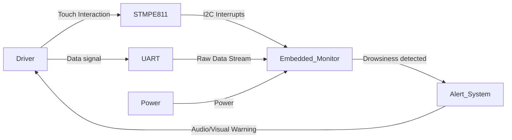
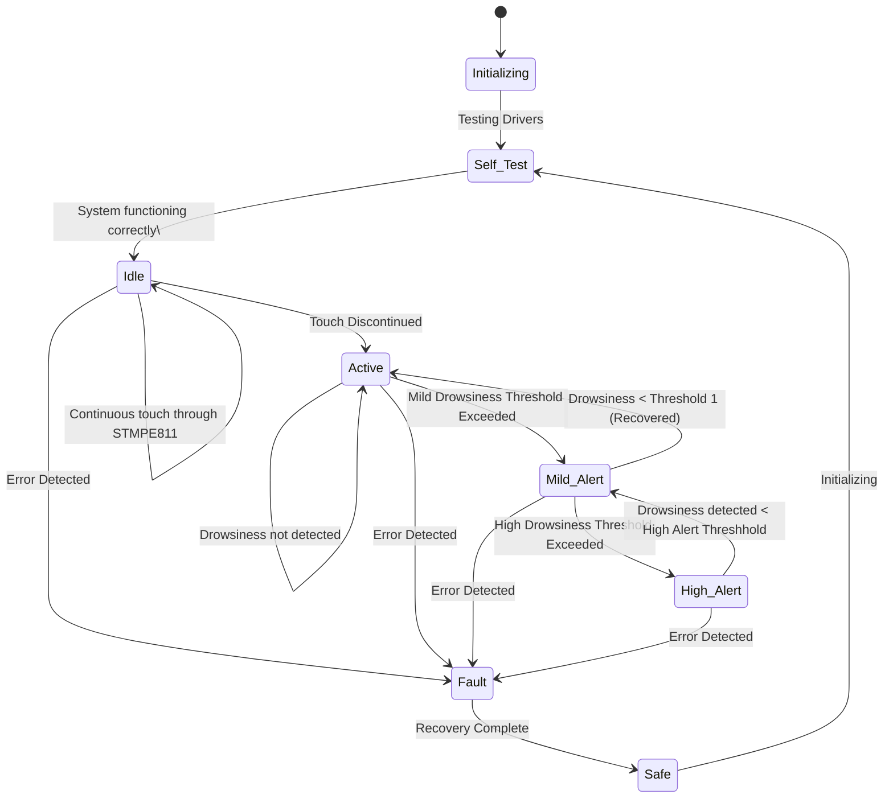

# CS G523 – Driver Drowsiness Detection System
## System Boundary

### Inside the System
- Main Controller Logic
- System Driver
- Signal Processing
- Alert Management 
- Safety Enforcement 

### Outside the System
- The User (Driver) 
- PC Simulator 
- Touch Interface Screen
- Power Supply 

### Assumptions
- When the user touches the screen (STMPE811), the system is **Idle**. When touch is discontinued, the system assumes driving has started (**Active**).
- The system is designed to attempt a self-repair by transitioning from Fault to Safe and then back to Self_Test without requiring a hard power cycle for transient errors.
- Data is assumed to be continuous once the system enters the Active state.

---

## System Context

### Actors and Interfaces

| Actor / Entity | Type | Interface Description |
|---------------|------|-----------------------|
| Driver | User | Interacts via Touch interface to Pause/Start. |
| STMPE811 | Hardware | I2C Touch Controller. Detects user interaction to toggle Idle/Active modes. |
| PC based simulator | Simulator | Provides data stream (UART). |
| Alert System | Actuator | Buzzer and LEDs for Mild and High alerts. |
| Watchdog | Internal | Independent hardware timer to reset system if firmware hangs. |
---

### System Context Diagram

---

## Selected Use Cases

| ID | Use Case | Actor | Description |
| --- | --- | --- | --- |
| UC-01 | System Startup | System | Power on, run self-diagnostics, and enter Idle mode. |
| UC-02 | Start Monitoring | Driver | Release touch screen to transition from Idle to Active monitoring. |
| UC-03 | Detect Mild Drowsiness | System | EEG metric exceeds Threshold 1; trigger Mild Alert. |
| UC-04 | Escalation to High Alert | System | Drowsiness persists/worsens > Threshold 2; trigger Critical Alert. |
| UC-05 | Fault Recovery | System | Detect internal error, neutralize outputs, and attempt self-restart. |

---

### Use Case Descriptions

#### UC-01: System Startup
* **Goal:** Initialize the microcontroller.
* **Trigger:** Power is applied to the system (Switch ON).
* **Main Interaction:** Boot microcontroller → initialize peripherals → run driver tests (EEG module, touch controller STMPE811) → verify system health.
* **Outcome:** Enters Idle state if self-test passes; otherwise enters Fault if any test fails.

#### UC-02: Start Monitoring
* **Goal:** Transition the system from standby to active state.
* **Trigger:** Driver releases contact with the touch sensor.
* **Main Interaction:** Detect loss of continuous touch → start EEG sampling → apply data processing and metric computation → enable continuous monitoring loop.
* **Outcome:** System transitions to Active state and continuously evaluates drowsiness.

#### UC-03: Detect Mild Drowsiness
* **Goal:** Provide an early warning to the driver before the situation becomes critical.
* **Trigger:** Calculated EEG drowsiness metric exceeds Threshold 1.
* **Main Interaction:** Compare computed metric with Threshold 1 → update internal state → activate mild alert (Yellow LED, intermittent beep) → log mild drowsiness event.
* **Outcome:** System enters Mild_Alert state while continuing to monitor EEG.

#### UC-04: Recover From Mild Drowsiness 
* **Goal:** Return to normal monitoring when driver becomes alert again.  
* **Trigger:** EEG metric drops below Low Threshold (Threshold 1).  
* **Main Interaction:** Validate updated metric → deactivate mild alert → update driver state to recovered  
* **Outcome:**  System returns to Active state.

#### UC-05: Escalation to High Alert
* **Goal:** Strongly warn the driver of dangerous drowsiness.  
* **Trigger:** EEG metric exceeds High Threshold (Threshold 2).  
* **Main Interaction:** Validate critical threshold crossing → activate strong alert (Red LED, continuous loud alarm) → log critical drowsiness event  
* **Outcome:**  
System transitions to High_Alert state.

#### UC-06: De-escalation from High Alert 
* **Goal:** Reduce alert level when driver shows improvement.  
* **Trigger:** EEG metric drops below High Threshold but is still above Mild Threshold.  
* **Main Interaction:** Reduce alert intensity → update internal drowsiness status → continue monitoring  
* **Outcome:** System transitions back to Mild_Alert state.

#### UC-07: Fault Detection
* **Goal:** Handle hardware or logical failures safely.  
* **Trigger:** Error detected (UART failure, sensor malfunction, logic fault).  
* **Main Interaction:** Stop current processing → isolate faulty module → log error/state  
* **Outcome:** System enters Fault state.

#### UC-08: Fault Recovery (Fault → Safe → Self_Test)
* **Goal:** Recover from errors and restore normal system behavior.  
* **Trigger:** Fault recovery routine completes.  
* **Main Interaction:** Reset affected subsystems → restore stable configuration → verify sensor interfaces → re-run self-test  
* **Outcome:** System enters Safe state → transitions to Self_Test → returns to Idle if successful.
---

## UML Statechart (Behavioral Model)

---

## State Descriptions

### Initializing
* **Description:** Basic setup.
* **Exit Actions:** Call Self_Test.

### Self_Test
* **Description:** Diagnostic state. Checks if drivers are working correctly.
* **Behavior:** If hardware checks fail, it may retry or trap.
* **Transitions:** Goes to Idle only if all hardware passes.

### Idle
* **Description:** Standby mode. Triggered by continuous user interaction (touch).
* **Safety:** Alerts are disabled.
* **Transitions:** Moves to Active when the user stops touching the screen.

### Active
* **Description:** The main operational loop.
* **Activities:**
    * Read EEG Data.
    * Calculate Drowsiness Index.
    * Compare against Thresholds.
* **Transitions:** Can move to Mild_Alert (drowsy) or Fault (error).

### Mild_Alert
* **Description:** Early warning state.
* **Output:** Low-level alert (e.g., Yellow LED, intermittent beep).
* **Logic:** Non-latching; if the driver recovers, it returns to Active. If they worsen, it goes to High_Alert.

### High_Alert
* **Description:** Critical danger state.
* **Output:** High-level alert (e.g., Red LED, continuous loud alarm).
* **Logic:** Hysteresis-based. Requires significant improvement in EEG signals to return to Mild_Alert.

### Fault
* **Description:** Exception handling state.
* **Triggers:** Internal hardware/software errors.
* **Entry Actions:** Log specific error code.
* **Exit Actions:** Perform "Recovery Complete" cleanup logic.

### Safe
* **Description:** Output Neutral state.
* **Goal:** Ensure no actuators are left in a dangerous state before attempting a restart.
* **Transitions:** Automatically transitions back to Self_Test to try and reboot the logic.

---

## Safety and Error Handling (Behavioral View)

### Safety Principles
* **Fail-Safe:** In the event of a crash or sensor failure, the system transitions to Safe state.
* **Graceful Degradation:** If the system encounters a transient error, it does not hang indefinitely; it attempts a Self_Test loop to recover functionality.
* **Priority of Faults:** A Fault condition overrides all Alert conditions. If the sensor fails during a High_Alert, the alarm stops (Safe State) to prevent false positives or undefined behavior.

### Error Handling Strategies

| Error Condition | State Transition | Mitigation Strategy |
| --- | --- | --- |
| **I2C Bus Error** | To Fault | Reset I2C peripheral, log error, try restart. |
| **EEG Signal Loss** | To Fault | Stop processing noise. |
| **Touch Sensor Hang** | To Fault | Watchdog timer will trigger if touch interrupt is stuck. |
| **Stack Overflow** | To HardFault | Triggers System Reset. |

### Alert Management
* **Mild Alert:** Recoverable. Stops automatically if EEG signals normalize.
* **High Alert:** Persistent. Designed to be annoying to force driver reaction.
* **Recovery Hysteresis:** To prevent "flickering" between Mild and High alerts, the signal must drop significantly below the High threshold to de-escalate.
---

## Change Log

| Date | Change | Author  |
| --- | --- | --- |
|  | Initial version |  |
